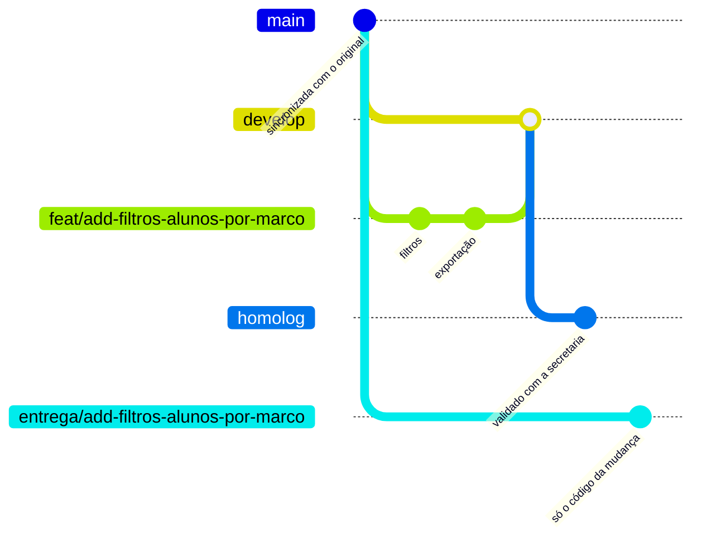

# Como contribuir

Regras de branch, commit, pull request, migrations e sincronização com o repositório original. Valem para todos os integrantes da Equipe E4.

As tarefas de cada sprint ficam no Trello da equipe, gerenciado pela Scrum Master. Cada tarefa tem um id de mudança e um número, e é por eles que o trabalho é citado aqui no repositório.

## 1. Princípios

1. **O trabalho acontece neste fork.** Ninguém faz push no repositório original, `ldhonorato/PPGEC_rec`.
2. **Uma mudança corresponde a uma branch e a um pull request.** Nada de branch com duas entregas misturadas.
3. **Nenhum commit vai direto para `main`, `develop` ou `homolog`.** Tudo entra por pull request revisado.
4. **O que vai para o repositório original leva só código.**
5. **Documentos de planejamento, anotações de reunião e listas de tarefas não entram no repositório.** Uma entrega é citada só pelo id da mudança e pelo número da tarefa.
6. **O merge na `main` do repositório original vai direto para produção**, com as migrations aplicadas na subida. Por isso as regras de migration (seção 5) são as mais rígidas deste documento.

## 2. Branches

| Branch | Para que serve | Quem escreve nela |
|---|---|---|
| `main` | Espelho da `main` do repositório original. Só recebe a sincronização semanal | Tech Lead |
| `develop` | Integração do trabalho da equipe | Pull requests aprovados |
| `homolog` | Versão validada com a secretaria antes de ir ao repositório original | Pull request da `develop` no fim de cada sprint |
| `tipo/descricao` | Trabalho de uma mudança | Responsável pela mudança |
| `entrega/<id-da-mudança>` | Pull request ao repositório original, criada a partir da `main` | Tech Lead |

### Nome das branches de trabalho

Formato `tipo/descricao-em-kebab-case`, com o mesmo tipo do commit (seção 3). Quando a branch implementa uma mudança, a descrição é o id da mudança.

| Exemplo | Quando usar |
|---|---|
| `feat/add-filtros-alunos-por-marco` | Mudança com funcionalidade nova |
| `fix/limite-efetivo-com-trancamento` | Correção fora de uma mudança |
| `docs/guia-do-ambiente-local` | Só documentação |
| `test/casos-de-situacao-academica` | Só testes ou dados de teste |
| `chore/pre-commit-no-modulo` | Configuração, dependências, CI |

Sem acento, sem maiúscula, sem número de cartão do Trello no nome.

### Como começar uma tarefa

```bash
git clone https://github.com/gustavosouto/PPGEC_rec.git
cd PPGEC_rec
git checkout develop
git pull
git checkout -b feat/id-da-mudanca
```

Antes de abrir o pull request, traga o que entrou na `develop` enquanto você trabalhava:

```bash
git fetch origin
git merge origin/develop
```

### Proteção das branches

Igual para `main`, `develop` e `homolog`:

- merge só por pull request, com 1 aprovação;
- aprovação anulada quando entra commit novo depois dela;
- conversas de revisão resolvidas antes do merge;
- sem force push e sem apagar a branch.

A regra não vale para o administrador do fork (Tech Lead), porque a sincronização semanal da seção 6 envia a `main` do repositório original direto para a `main` do fork. Fora a sincronização, o Tech Lead também trabalha por pull request.

### Fluxo



A branch `entrega/...` nasce da `main` e recebe só os commits da mudança, por `git cherry-pick`. Assim o pull request ao repositório original não arrasta trabalho de outras mudanças que ainda estão na `develop`.

## 3. Commits

### Formato

```
tipo(escopo): descrição do que passa a existir ou a funcionar

Corpo em prosa, explicando o porquê e o que não é óbvio no código.
Linhas de até 72 caracteres. Cita a mudança e a tarefa quando
houver: tarefa 2.1 da mudança add-filtros-alunos-por-marco.
```

### Regras

- **Português, com acentuação correta.** A exceção são caminhos e nomes que não levam acento no código, como `processos/models.py`.
- **Tipo obrigatório**, sempre em minúsculas, de acordo com a tabela abaixo.
- **Escopo opcional**, em minúsculas, com o nome da área do sistema afetada (por exemplo `situacao-academica` ou `dashboards`). Sem área definida, fica sem escopo.
- **Descrição** em minúsculas, sem ponto final, com até 72 caracteres contando o tipo. Ela descreve o resultado, e não a ação de quem escreveu: "filtro de alunos com marco no semestre" em vez de "adicionei filtro".
- **Corpo** quando a mudança não se explica sozinha: o porquê, a regra de negócio envolvida e a referência à tarefa. Separado da primeira linha por uma linha em branco.
- **Sem rodapés (trailers)** de coautoria ou de assinatura.
- **Um assunto por commit.** Cada commit deixa os testes passando.
- Nada de "ajustes", "wip", "teste" ou "atualização em geral" como mensagem.

### Tipos

| Tipo | Quando usar |
|---|---|
| `feat` | Funcionalidade nova para o usuário |
| `fix` | Correção de comportamento errado |
| `refactor` | Mudança de estrutura sem mudar comportamento |
| `test` | Testes e dados de teste |
| `docs` | Documentação |
| `chore` | Configuração, dependências, CI, arquivos de ambiente |
| `perf` | Melhoria de desempenho sem mudar comportamento |
| `revert` | Desfazer um commit anterior, citando o hash no corpo |

### Exemplos

```
feat(situacao-academica): limite efetivo com prorrogação e trancamento

O prazo regimental nunca muda. O limite efetivo soma as prorrogações
aprovadas e o tempo de trancamento. Tarefa 1.2 da mudança
add-situacao-marcos-academicos.
```

```
fix(situacao-academica): quem não apresentou conta como reprovado
```

```
test: alunos fictícios com prazos vencidos, prorrogados e trancados
```

```
docs: guia para rodar o Acadflow com SQLite
```

## 4. Pull requests

### Título

Mesmo formato do commit: `feat(dashboards): painel de distribuição de docentes`.

### Descrição

```markdown
## O que muda
O que o usuário passa a ver ou fazer, em duas ou três frases.

## Alterações
- Arquivos e partes do sistema afetados.
- Migrations criadas, com o que cada uma faz.

## Escopo
Mudança e tarefas cobertas. O que ficou de fora de propósito.

## Como testar
Passos para conferir localmente, com os dados fictícios.

## Checklist
- [ ] Testes passando (`python manage.py test`)
- [ ] Migrations revisadas (seção 5)
- [ ] Nenhum dado real, senha ou `.env` no código
- [ ] Nenhum documento de planejamento ou anotação de reunião no diff
- [ ] Com a chave do módulo desligada, o sistema se comporta como antes
- [ ] Ensaio de produção executado (só no pull request ao repositório original)
```

O pull request interno vai para a `develop` **deste fork**. Ao abrir pela linha de comando, informe o repositório, porque o padrão do GitHub num fork é o repositório original:

```bash
gh pr create --repo gustavosouto/PPGEC_rec --base develop
```

### Revisão

- Pelo menos uma aprovação antes do merge. Quem abriu não aprova o próprio pull request.
- Pull request com migration precisa da aprovação do Tech Lead ou do QA & DevOps.
- Comentários de revisão são resolvidos por quem abriu, e a conversa é encerrada por quem comentou.
- Merge com commit de merge (sem squash), para manter o histórico de cada tarefa.
- A branch de trabalho é apagada depois do merge.

### Pull request ao repositório original

- Sai da branch `entrega/<id-da-mudança>` para a `main` do `ldhonorato/PPGEC_rec`.
- Uma mudança por pull request, só com código.
- A descrição segue o mesmo modelo. Em "Como testar", os passos precisam funcionar sem os dados fictícios da equipe.
- Só é aberto depois que a mudança passou pela `homolog` e foi validada pelo Product Owner com a secretaria.

### O Acadflow em produção não pode quebrar

O merge na `main` do repositório original vai para produção em poucos minutos. O contêiner `web` aplica as migrations ao subir, e uma migration com falha impede o site de subir, sem volta automática para a versão anterior. Por isso, todo pull request ao repositório original segue estas regras:

- Os testes do fork passam em PostgreSQL 16, o mesmo banco da produção, e não só em SQLite.
- O ensaio de produção foi executado: imagem construída com o `Dockerfile` do projeto, serviços do `docker-compose-prod.yml` no ar, migrations aplicadas sobre um banco já migrado até a `main` do repositório original e páginas principais abertas com cada perfil, sem exceção no log e sem contêiner reiniciando. O resultado vai na descrição do pull request.
- Tudo que o módulo da equipe mostra ou executa fica atrás da chave do módulo, desligada por padrão. Com a chave desligada, o sistema se comporta exatamente como antes. A descrição traz uma seção "Como ligar".
- Migrations só criam tabelas novas do módulo da equipe.
- Um pull request por vez, nunca dois no mesmo dia. Depois de cada merge, as páginas principais são conferidas em produção.

## 5. Migrations

- Uma migration por assunto, com nome descritivo: `python manage.py makemigrations processos --name prazo_marco_semestre`.
- Nunca editar uma migration que já foi para o repositório original. A correção vem numa migration nova.
- Não alterar nem apagar colunas de tabelas existentes sem uma decisão registrada pela equipe. O código novo da equipe prefere tabelas próprias.
- Toda migration é testada do zero (`migrate` num banco vazio) e sobre os dados fictícios antes do pull request.
- Depois de cada sincronização com o repositório original, conferir se apareceu migration de merge e rodar a suíte inteira.
- Migrations de dados (que preenchem ou transformam registros) precisam de função reversa ou de justificativa no corpo do commit.

## 6. Sincronização com o repositório original

Toda segunda-feira, feita pelo Tech Lead:

```bash
git fetch upstream
git checkout main
git merge --ff-only upstream/main
git push origin main
git checkout develop
git merge main
```

O remoto `upstream` aponta para `https://github.com/ldhonorato/PPGEC_rec.git`. Conflitos na `develop` são resolvidos numa branch `chore/sincroniza-com-original` e entram por pull request, como qualquer outra mudança.

## 7. Qualidade

- `python manage.py test` antes de todo push.
- O projeto não tem lint nem formatação configurados. Aplicar um formatador no projeto inteiro geraria um pull request enorme e difícil de aceitar. Por isso `ruff` (lint e formatação) com pre-commit vale só para os arquivos do módulo da equipe, com configuração prevista para a Sprint 1.
- Um workflow próprio do fork vai rodar a suíte de testes em cada pull request para a `develop`, sem publicar imagem.

## 8. Segurança e dados

- Este fork é público. Tudo que entra nele fica visível para qualquer pessoa.
- Nunca versionar `.env`, senhas, tokens ou dados reais de alunos e professores.
- Desenvolvimento, testes, prints e vídeos de apresentação usam só os dados fictícios gerados pelo comando da equipe (previsto para a Sprint 1), e não o `db.sqlite3` versionado.
